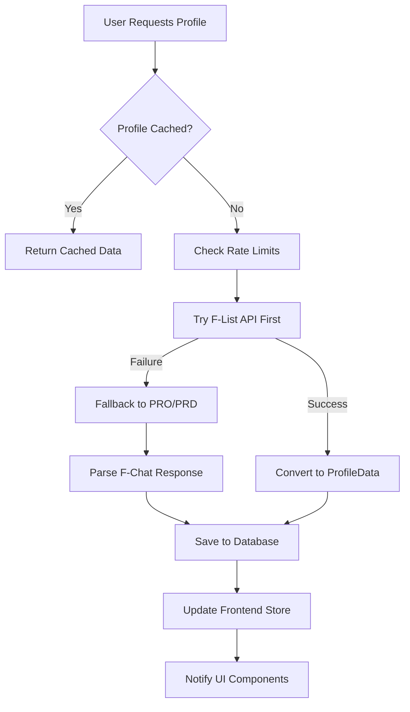
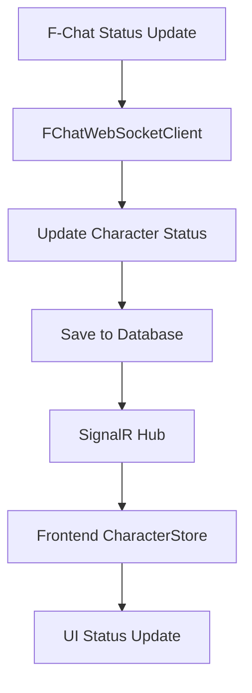

# F-ChatBouncer Character Profiles and Data Storage Documentation

This document provides a comprehensive overview of how character information and profiles are handled throughout the F-ChatBouncer system, including data flow, storage mechanisms, and update processes.

## Table of Contents

1. [Overview](#overview)
2. [Backend Character Data Models](#backend-character-data-models)
3. [Frontend Character Data Management](#frontend-character-data-management)
4. [Data Flow Architecture](#data-flow-architecture)
5. [Profile Update Mechanisms](#profile-update-mechanisms)
6. [Storage Systems](#storage-systems)
7. [Character Connection Management](#character-connection-management)
8. [API Integration](#api-integration)
9. [Troubleshooting Guide](#troubleshooting-guide)

## Overview

F-ChatBouncer manages character data through a unified system that consolidates information from multiple sources:

- **F-Chat WebSocket Protocol**: Real-time character status, profile data via PRO/PRD commands
- **F-List API**: Comprehensive character data via character-data.php endpoint
- **Database Storage**: Persistent storage in PostgreSQL with Entity Framework
- **Frontend State Management**: Zustand stores for real-time UI updates

The system uses a **unified character model** that replaces the previous fragmented approach, ensuring character data is shared across all connections and users.

## Backend Character Data Models

### Primary Models

#### 1. Character Model (`Models/Character.cs`)
The **unified character model** that consolidates all character information:

```csharp
public class Character
{
    public int Id { get; set; }
    public string Name { get; set; }                    // Unique identifier
    public string Status { get; set; }                  // online, away, busy, etc.
    public string? StatusMessage { get; set; }          // Status message
    public string Gender { get; set; }                  // Extracted from profile
    public DateTime LastSeen { get; set; }              // Last activity
    public DateTime FirstSeen { get; set; }             // Discovery timestamp
    public DateTime LastUpdated { get; set; }           // Last profile update
    public string? ProfileData { get; set; }            // Raw JSON from F-Chat
    public string? StructuredProfileData { get; set; }  // Parsed ProfileData
    public string? RawProData { get; set; }             // Debug: raw PRO command
    public bool IsOnline { get; set; }                  // Online status
    public string? Memo { get; set; }                   // User's memo/note
    public DateTime? MemoLastUpdated { get; set; }      // Memo timestamp
    
    // Navigation properties
    public virtual ICollection<CharacterConnection> Connections { get; set; }
    public virtual ICollection<CharacterChannel> Channels { get; set; }
}
```

**Key Features:**
- **Unified Storage**: Same character data shared across all connections
- **Profile Integration**: Stores both raw and structured profile data
- **Status Tracking**: Real-time online/offline status management
- **Memo Support**: User notes stored per character

#### 2. CharacterConnection Model (`Models/CharacterConnection.cs`)
Manages user-character relationships:

```csharp
public class CharacterConnection
{
    public int Id { get; set; }
    public string UserId { get; set; }                  // BouncerUser ID
    public int CharacterId { get; set; }                // Character ID
    public string FChatUsername { get; set; }           // F-Chat account
    public string FChatPasswordEncrypted { get; set; }  // Encrypted password
    public bool IsActive { get; set; }                  // Currently selected
    public bool IsConnected { get; set; }               // WebSocket connected
    public DateTime ConnectedAt { get; set; }           // Connection timestamp
    public DateTime LastActivityAt { get; set; }        // Last activity
    public DateTime CreatedAt { get; set; }             // Creation timestamp
}
```

**Purpose:**
- Links users to their F-Chat characters
- Manages connection states and credentials
- Tracks active character selection

#### 3. ProfileData Model (`Models/ProfileData.cs`)
Structured representation of F-Chat profile information:

```csharp
public class ProfileData
{
    public string CharacterName { get; set; }
    public Dictionary<string, string> Info { get; set; }        // Basic info fields
    public Dictionary<string, string> Select { get; set; }      // Selected fields
    public Dictionary<string, object> Additional { get; set; }  // Additional data
    public DateTime Timestamp { get; set; }                    // Creation time
    public string Gender { get; set; }                         // Extracted gender
}
```

**Structure:**
- **Info**: Basic character information (age, species, etc.)
- **Select**: Dropdown/selection fields (kinks, preferences)
- **Additional**: Any other profile data
- **Gender**: Normalized gender value extracted from profile

#### 4. CharacterDataResponse Model (`Models/CharacterDataResponse.cs`)
F-List API response structure:

```csharp
public class CharacterDataResponse
{
    public int Id { get; set; }
    public string Name { get; set; }
    public string Description { get; set; }
    public int ViewCount { get; set; }
    public Dictionary<string, string> Infotags { get; set; }
    public Dictionary<string, string> Kinks { get; set; }
    public Dictionary<string, CustomKink> CustomKinks { get; set; }
    public Dictionary<string, CharacterInline> Inlines { get; set; }
    public List<CharacterImage> Images { get; set; }
    public CharacterSettings? Settings { get; set; }
    // ... additional properties
}
```

### Legacy Models (Maintained for Backward Compatibility)

#### Profile Model (`Models/Profile.cs`)
Legacy profile storage:

```csharp
public class Profile
{
    public int Id { get; set; }
    public string UserId { get; set; }
    public string CharacterName { get; set; }
    public string ProfileData { get; set; }  // JSON payload
    public DateTime CreatedAt { get; set; }
    public DateTime UpdatedAt { get; set; }
    public string? RawProData { get; set; }  // Debug data
}
```

## Frontend Character Data Management

### State Management Stores

#### 1. ChatStore (`stores/chatStore.ts`)
Manages character-scoped chat data and global profile information:

```typescript
interface ChatStore {
  // Character-scoped data
  characterMessages: Record<string, Message[]>;
  characterSelectedChannels: Record<string, string[]>;
  characterJoinedChannels: Record<string, string[]>;
  characterConnectionStatus: Record<string, ConnectionStatus>;
  characterChannelMetadata: Record<string, Record<string, Channel>>;
  
  // Global profile data (shared across characters)
  profiles: Record<string, ProfileData>;
  profileRequestStatus: Record<string, 'idle' | 'requesting' | 'failed' | 'success'>;
  profileLastRequested: Record<string, number>;
  knownCharacters: Set<string>;
  
  // Profile management methods
  addProfile: (characterName: string, profileData: ProfileData) => void;
  getProfile: (characterName: string) => ProfileData | null;
  requestProfileForCharacter: (characterName: string) => Promise<void>;
}
```

**Key Features:**
- **Character Isolation**: Each character has separate message/channel state
- **Shared Profiles**: Profile data is global and shared across characters
- **Request Tracking**: Monitors profile request status and timing
- **Persistence**: Uses Zustand persist middleware for localStorage

#### 2. CharacterStore (`stores/characterStore.ts`)
Manages character connections and active character selection:

```typescript
interface CharacterStore {
  connections: CharacterConnection[];
  activeCharacter: string | null;
  connectionStatus: Record<string, 'connecting' | 'connected' | 'disconnected' | 'error'>;
  
  // Connection management
  addConnection: (connection: CharacterConnection) => void;
  removeConnection: (characterName: string) => void;
  setActiveCharacter: (characterName: string) => void;
  updateConnectionStatus: (characterName: string, status: ConnectionStatus) => void;
}
```

**Purpose:**
- Manages multiple character connections per user
- Tracks which character is currently active
- Handles connection state updates
- Persists connection data to localStorage

### Frontend ProfileData Interface (`types/index.ts`)

```typescript
export interface ProfileData {
  character: string;
  info: Record<string, string>;
  select: Record<string, string>;
  additional: Record<string, any>;
  timestamp: string;
  gender: string;
}
```

### Kinks Data Management (`kinks.ts`)

The frontend maintains a comprehensive static kinks database for profile display and search functionality:

```typescript
// Static kinks data imported from kinks.ts
const kinksData = {
  kinks: [
    { fetish_id: "77", name: "3+ Penetration" },
    { fetish_id: "1", name: "Abrasions" },
    // ... 700+ kinks with IDs and names
  ],
  genders: ["Male", "Female", "Transgender", "Herm", "Shemale", "Male-Herm", "Cunt-boy", "None"],
  roles: ["Always submissive", "Usually submissive", "Switch", "Usually dominant", "Always dominant"],
  orientations: ["Gay", "Bi - male preference", "Bisexual", "Bi - female preference", "Straight", "Asexual", "Pansexual", "Bi-curious", "Unsure"],
  positions: ["Always Bottom", "Usually Bottom", "Switch", "Usually Top", "Always Top"],
  languages: ["Arabic", "Chinese", "Dutch", "English", "French", "German", "Italian", "Japanese", "Korean", "Other", "Portuguese", "Russian", "Spanish", "Swedish"]
};
```

**Usage:**
- **Profile Display**: Converts kink IDs from profile data to human-readable names
- **Search Functionality**: Provides kink selection interface for character searches
- **Profile Parsing**: Maps F-List kink IDs to display names in profile components

**Kink Storage in Profiles:**
- Kinks are stored in `ProfileData.info` with keys like `kink_{fetish_id}`
- Values contain preference levels (e.g., "Love", "Like", "Maybe", "Dislike", "Fave")
- Frontend uses `kinksData.kinks` to resolve IDs to names for display

## Data Flow Architecture

### 1. Profile Data Acquisition Flow



### 2. Character Status Update Flow



### 3. Profile Update Process

The system uses a **dual-source approach** for profile data:

1. **Primary**: F-List API (`character-data.php`)
   - More comprehensive data
   - Better structured response
   - Includes images, kinks, infotags

2. **Fallback**: F-Chat PRO/PRD commands
   - Real-time via WebSocket
   - Available when API fails
   - Basic profile information

## Profile Update Mechanisms

### 1. F-List API Integration

#### FListCharacterDataService (`Services/FListCharacterDataService.cs`)

**Primary Methods:**
- `GetCharacterDataWithMappingAndTicketRenewalAsync()`: Main entry point
- `GetCharacterDataAsync()`: Basic API call
- `ConvertToProfileData()`: Transform API response to ProfileData

**Features:**
- **Automatic Ticket Renewal**: Handles expired F-List API tickets
- **Error Handling**: Graceful fallback on API failures
- **Mapping Integration**: Applies human-readable names to kinks/infotags
- **Rate Limiting**: Respects F-List API limits

**API Request Format:**
```http
POST https://www.f-list.net/json/api/character-data.php
Content-Type: application/x-www-form-urlencoded

name=CharacterName&ticket=APITicket&account=Username
```

### 2. F-Chat WebSocket Profile Commands

#### PRO Command (Profile Request)
```json
{
  "command": "PRO",
  "character": "CharacterName"
}
```

#### PRD Command (Profile Response)
Handled by `FChatWebSocketClient.HandlePRDCommandAsync()`:

```json
{
  "command": "PRD",
  "character": "CharacterName",
  "data": {
    "type": "start|info|select|end",
    "content": "Profile data"
  }
}
```

**Processing Steps:**
1. **Start**: Initialize profile data collection
2. **Info**: Add basic information fields
3. **Select**: Add selection-based fields
4. **End**: Finalize and save profile data

### 3. ProfileService (`Services/ProfileService.cs`)

**Core Methods:**
- `RequestProfileAsync()`: Main profile request entry point
- `SaveStructuredProfileAsync()`: Save parsed profile data
- `GetCachedProfileAsync()`: Retrieve cached profiles with staleness check
- `GetCharacterDataAsync()`: Direct F-List API access

**Features:**
- **Dual-Source Strategy**: Tries F-List API first, falls back to PRO/PRD
- **Caching**: 6-hour cache with stale data handling
- **Rate Limiting**: Prevents excessive API calls
- **Background Refresh**: Automatically refreshes stale profiles
- **Error Recovery**: Graceful handling of API failures

## Storage Systems

### 1. Database Storage (PostgreSQL)

#### Character Table Structure
```sql
CREATE TABLE Characters (
    Id SERIAL PRIMARY KEY,
    Name VARCHAR(100) NOT NULL UNIQUE,
    Status VARCHAR(50) NOT NULL DEFAULT 'offline',
    StatusMessage VARCHAR(500),
    Gender VARCHAR(50) NOT NULL DEFAULT 'None',
    LastSeen TIMESTAMP NOT NULL DEFAULT NOW(),
    FirstSeen TIMESTAMP NOT NULL DEFAULT NOW(),
    LastUpdated TIMESTAMP NOT NULL DEFAULT NOW(),
    ProfileData TEXT,
    StructuredProfileData TEXT,
    RawProData TEXT,
    IsOnline BOOLEAN NOT NULL DEFAULT FALSE,
    Memo VARCHAR(1000),
    MemoLastUpdated TIMESTAMP
);
```

#### CharacterConnections Table
```sql
CREATE TABLE CharacterConnections (
    Id SERIAL PRIMARY KEY,
    UserId VARCHAR(450) NOT NULL,
    CharacterId INTEGER NOT NULL REFERENCES Characters(Id),
    FChatUsername VARCHAR(100) NOT NULL,
    FChatPasswordEncrypted VARCHAR(500) NOT NULL,
    IsActive BOOLEAN NOT NULL DEFAULT FALSE,
    IsConnected BOOLEAN NOT NULL DEFAULT FALSE,
    ConnectedAt TIMESTAMP NOT NULL,
    LastActivityAt TIMESTAMP NOT NULL,
    CreatedAt TIMESTAMP NOT NULL DEFAULT NOW()
);
```

### 2. Frontend Storage (localStorage)

#### ChatStore Persistence
```typescript
{
  "profiles": {
    "CharacterName": {
      "character": "CharacterName",
      "info": { "Age": "25", "Species": "Human" },
      "select": { "Gender": "Female" },
      "additional": {},
      "timestamp": "2024-01-01T00:00:00.000Z",
      "gender": "Female"
    }
  },
  "knownCharacters": ["CharacterName"],
  "profileRequestStatus": {
    "CharacterName": "success"
  },
  "profileLastRequested": {
    "CharacterName": 1704067200000
  }
}
```

#### CharacterStore Persistence
```typescript
{
  "connections": [
    {
      "characterName": "CharacterName",
      "isConnected": true,
      "isActive": true,
      "status": "connected",
      "lastActivity": "2024-01-01T00:00:00.000Z",
      "connectedAt": "2024-01-01T00:00:00.000Z"
    }
  ],
  "activeCharacter": "CharacterName"
}
```

## Character Connection Management

### 1. Connection Lifecycle

1. **User Authentication**: Google OAuth → BouncerUser creation
2. **Character Addition**: User adds character via CharacterManagement UI
3. **F-Chat Connection**: WebSocket connection established with F-Chat
4. **Status Monitoring**: Real-time status updates via WebSocket
5. **Profile Requests**: On-demand profile data retrieval
6. **Disconnection**: Clean shutdown and status update

### 2. Multi-Character Support

**Key Features:**
- **Multiple Connections**: Users can connect multiple F-Chat characters
- **Active Character**: Only one character active at a time
- **Shared Data**: Profile data shared across all characters
- **Isolated Chat**: Each character has separate message/channel state

### 3. Connection State Management

```typescript
type ConnectionStatus = 'connecting' | 'connected' | 'disconnected' | 'error';
```

**State Transitions:**
- `connecting` → `connected`: Successful WebSocket connection
- `connected` → `disconnected`: Normal disconnection
- `connected` → `error`: Connection failure
- `error` → `connecting`: Reconnection attempt

## API Integration

### 1. F-List API Integration

#### Ticket Management
- **FListTicketManager**: Handles API ticket lifecycle
- **Automatic Renewal**: Refreshes expired tickets
- **Error Recovery**: Handles ticket expiration gracefully

#### Character Data Endpoint
- **URL**: `https://www.f-list.net/json/api/character-data.php`
- **Method**: POST
- **Authentication**: F-Chat credentials + API ticket
- **Rate Limits**: Respects F-List API limits

### 2. F-Chat WebSocket Protocol

#### Profile Commands
- **PRO**: Request character profile
- **PRD**: Profile response data
- **STA**: Status updates
- **NLN/FLN**: Online/offline notifications

#### Real-time Updates
- **Status Changes**: Immediate status updates
- **Profile Updates**: Real-time profile modifications
- **Channel Activity**: Channel join/leave events

## Troubleshooting Guide

### Common Issues and Solutions

#### 1. Profile Data Not Loading

**Symptoms:**
- Profile requests fail
- "No profile data" displayed
- API errors in logs

**Diagnostic Steps:**
1. Check F-Chat credentials in user settings
2. Verify F-List API ticket status
3. Review rate limiting logs
4. Check network connectivity

**Solutions:**
- Refresh F-Chat credentials
- Clear rate limiting cache
- Retry with exponential backoff
- Fall back to PRO/PRD commands

#### 2. Character Status Not Updating

**Symptoms:**
- Characters show as offline when online
- Status messages not updating
- Connection status incorrect

**Diagnostic Steps:**
1. Check WebSocket connection status
2. Verify F-Chat server connectivity
3. Review character connection logs
4. Check database character records

**Solutions:**
- Reconnect character
- Restart WebSocket connection
- Refresh character status
- Clear connection cache

#### 3. Profile Data Inconsistencies

**Symptoms:**
- Different profile data between characters
- Stale profile information
- Missing profile fields

**Diagnostic Steps:**
1. Compare database vs. cache data
2. Check profile update timestamps
3. Verify API vs. WebSocket data
4. Review profile parsing logs

**Solutions:**
- Force profile refresh
- Clear profile cache
- Re-parse existing data
- Update profile parsing logic

### Debug Tools

#### 1. Frontend Character Inspection
- **Component**: `FrontendCharacterInspection.tsx`
- **Purpose**: Debug frontend character state
- **Features**: Profile status, connection info, request history

#### 2. Backend Logging
- **Profile Requests**: Detailed request/response logging
- **API Calls**: F-List API interaction logs
- **WebSocket Events**: F-Chat protocol message logs
- **Database Operations**: Entity Framework query logs

#### 3. Database Queries

**Check Character Data:**
```sql
SELECT Name, Status, IsOnline, LastUpdated, 
       CASE WHEN StructuredProfileData IS NOT NULL THEN 'Structured' ELSE 'Raw' END as ProfileType
FROM Characters 
WHERE Name = 'CharacterName';
```

**Check Connection Status:**
```sql
SELECT cc.UserId, c.Name, cc.IsConnected, cc.IsActive, cc.LastActivityAt
FROM CharacterConnections cc
JOIN Characters c ON cc.CharacterId = c.Id
WHERE c.Name = 'CharacterName';
```

**Check Profile Data:**
```sql
SELECT CharacterName, UpdatedAt, 
       LENGTH(ProfileData) as RawDataSize,
       LENGTH(StructuredProfileData) as StructuredDataSize
FROM Profiles 
WHERE CharacterName = 'CharacterName';
```

### Performance Considerations

#### 1. Caching Strategy
- **Profile Cache**: 6-hour TTL with stale-while-revalidate
- **Character Status**: Real-time updates with 5-minute fallback
- **Connection State**: Persistent localStorage with session sync

#### 2. Rate Limiting
- **F-List API**: 60 requests per hour per user
- **Profile Requests**: 1 request per character per 5 minutes
- **WebSocket**: No artificial limits (F-Chat protocol limits apply)

#### 3. Database Optimization
- **Indexes**: Name, UserId, CharacterId for fast lookups
- **Cleanup**: Remove stale connection data after 30 days
- **Partitioning**: Consider partitioning by date for large datasets

---

This documentation provides a comprehensive overview of the character profile and data management system in F-ChatBouncer. For specific implementation details, refer to the individual service files and models mentioned throughout this document.
